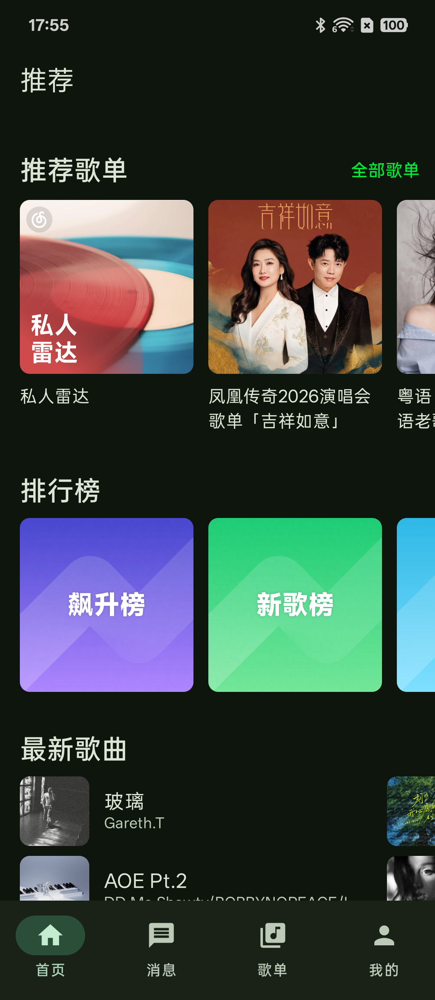
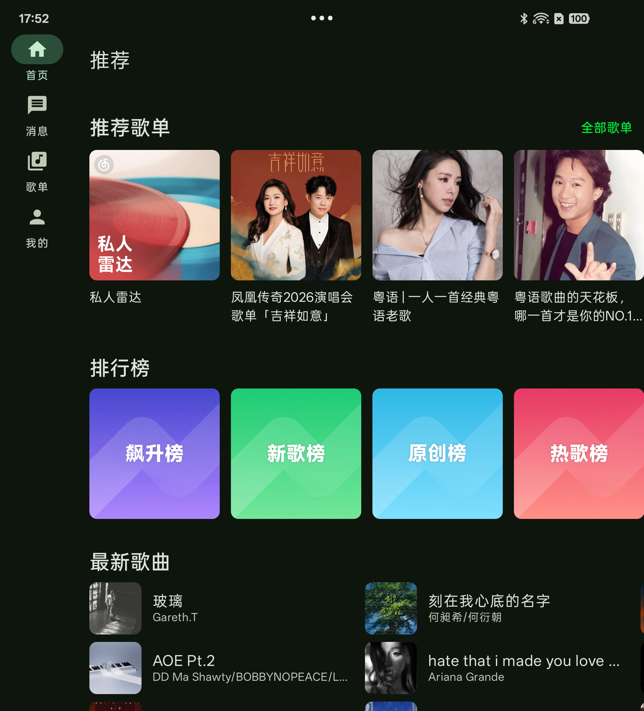
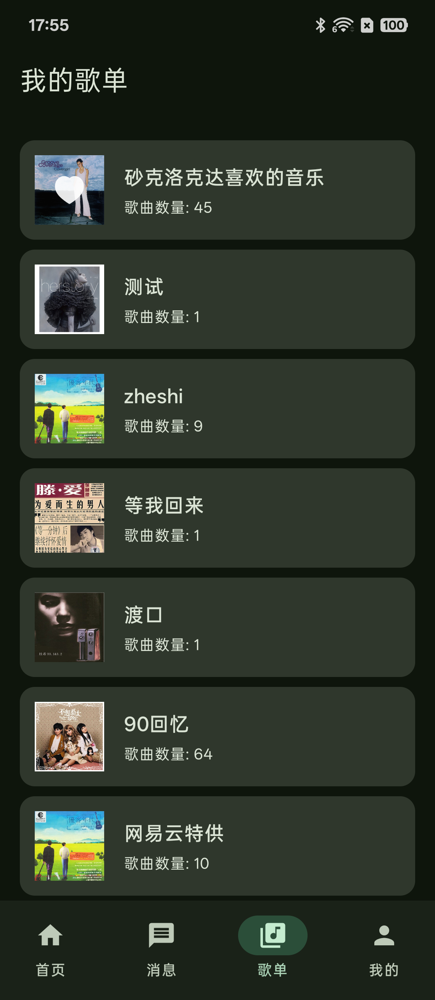
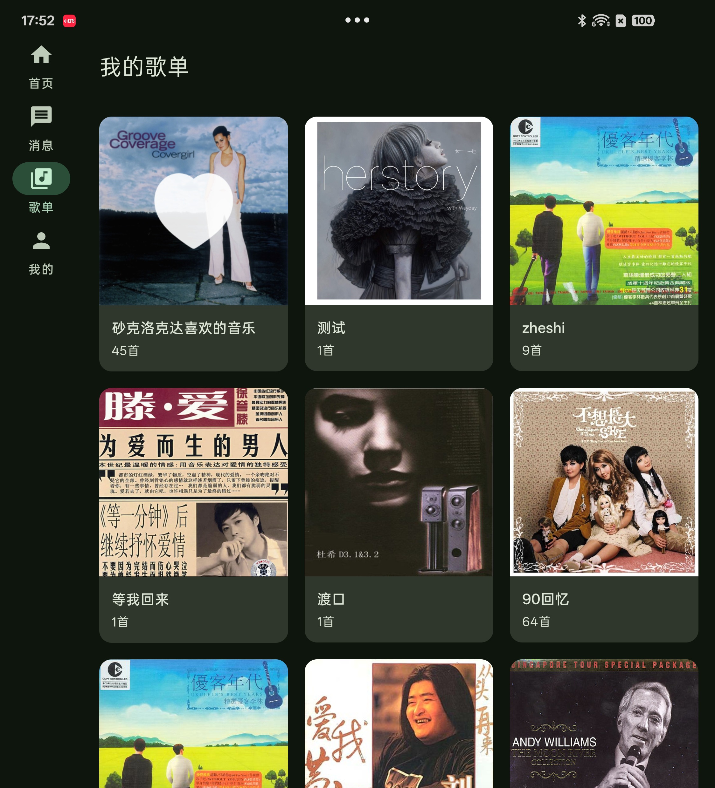
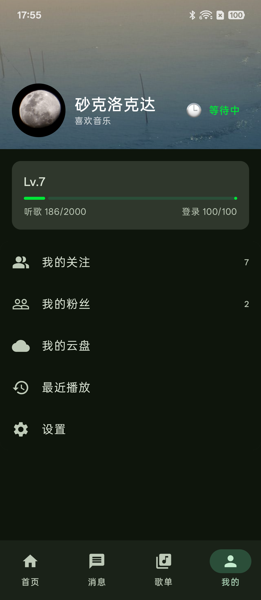
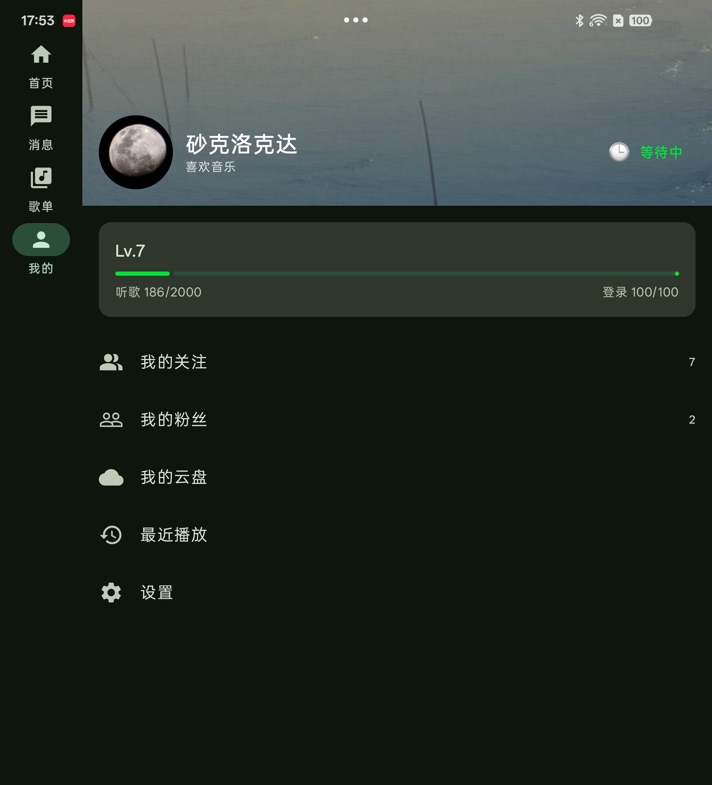
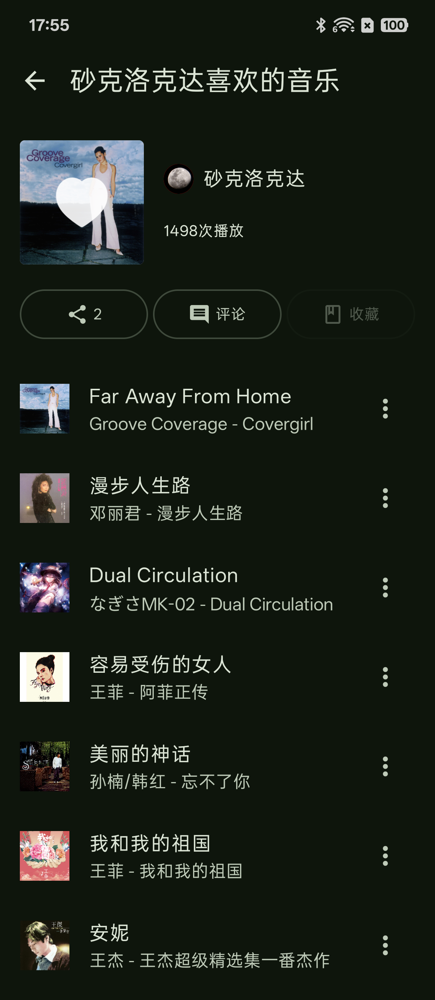
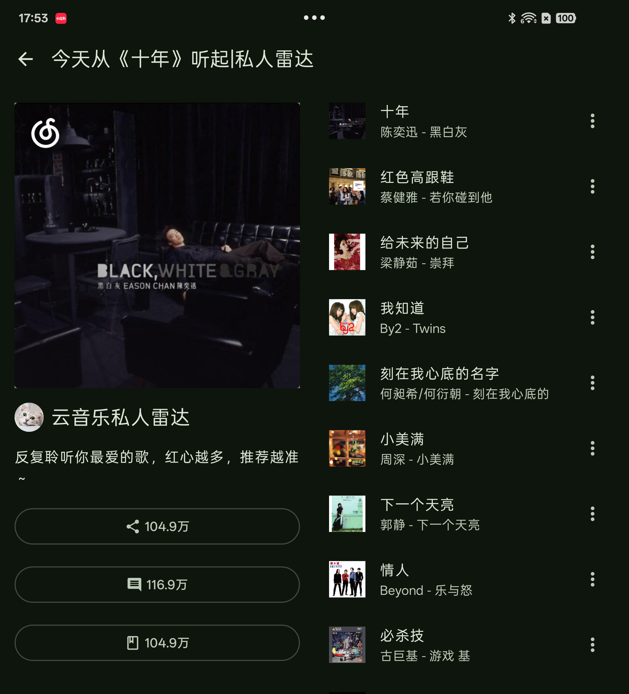
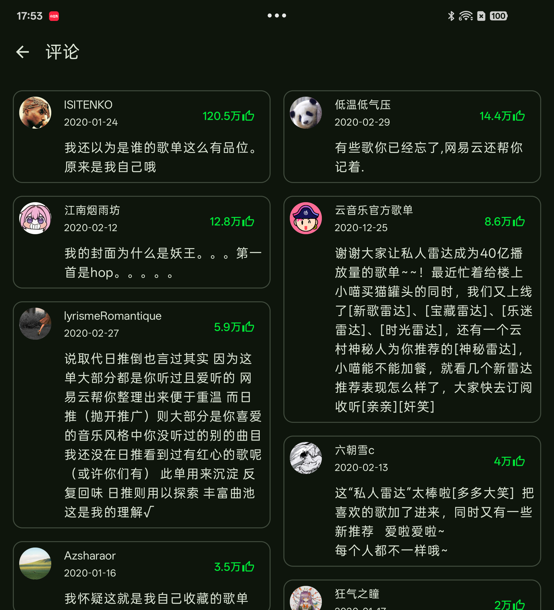

# ComposeMusic2026

一个基于 Jetpack Compose 构建的 Android 社交音乐客户端，采用现代 Android 开发技术栈，实现了歌单浏览、艺人详情、评论互动、消息通知等核心功能。

## 功能截图

<table>
  <tr>
    <th>页面</th>
    <th>手机</th>
    <th>折叠屏 / 平板</th>
  </tr>
  <tr>
    <td>推荐首页</td>
    <td></td>
    <td></td>
  </tr>
  <tr>
    <td>消息</td>
    <td></td>
    <td></td>
  </tr>
  <tr>
    <td>我的歌单</td>
    <td></td>
    <td></td>
  </tr>
  <tr>
    <td>我的</td>
    <td></td>
    <td></td>
  </tr>
  <tr>
    <td>歌单详情</td>
    <td></td>
    <td></td>
  </tr>
  <tr>
    <td>评论</td>
    <td></td>
    <td></td>
  </tr>
  <tr>
    <td>艺人详情</td>
    <td></td>
    <td></td>
  </tr>
</table>

## 主要功能

| 模块 | 功能 |
|------|------|
| 推荐 | 首页推荐（歌曲、歌单、新歌、榜单、艺人） |
| 歌单 | 歌单详情、我的歌单、热门歌单（分页） |
| 艺人 | 艺人列表（分页）、艺人详情、粉丝列表 |
| 用户 | 用户详情、动态状态、关注/粉丝 |
| 评论 | 多资源类型评论、子评论、分页加载 |
| 消息 | 私信、评论通知、系统通知 |
| 登录 | 二维码扫码登录 |

## 技术栈

```
语言            Kotlin 2.3.21
UI              Jetpack Compose (BOM 2026.05.01) + Material 3
架构            MVVM + Clean Architecture
依赖注入        Hilt 2.59.2
导航            Navigation 3 (类型安全路由)
网络            Retrofit 3 + OkHttp 5
图片加载        Coil 3 (OkHttp 集成)
分页            Paging 3
本地存储        Room 2.8.4 + MMKV
构建            KSP + AGP 9.2.1
```

## 项目结构

```
app/src/main/java/com/ke/music/app/
├── data/
│   ├── api/          # Retrofit 接口 & 工具函数
│   ├── model/        # 数据模型 (BaseVO、User、Playlist、Artist …)
│   ├── repository/   # 7 个仓储类，统一封装 safeApiCall
│   └── store/        # AppDataStore (MMKV token 存储)
├── di/               # Hilt 网络模块
└── ui/
    ├── components/   # 公共组件 (LoadingView、RetryView …)
    ├── navigation/   # 路由目的地定义
    ├── theme/        # Material 3 主题 / 颜色 / 字体
    └── screen/       # 17 个功能页面，每页一对 Screen + ViewModel
```

## 环境要求

- Android Studio Meerkat 或更新版本
- JDK 11+
- minSdk 24（Android 7.0）
- targetSdk 36（Android 14）

## 快速开始

1. 克隆仓库

```bash
git clone <repo-url>
cd ComposeMusic2026
```

2. 在 `app/src/main/java/…/di/NetworkModule.kt` 中确认 API Base URL（默认 `https://ke-api.cpolar.top/`），如需替换请修改该常量。

3. 使用 Android Studio 打开项目，等待 Gradle Sync 完成，运行即可。

## 架构说明

### 启动流程

```
SplashScreen
    ↓ 检查 token
LoginScreen (二维码登录)
    ↓ 登录成功
MainScreen
    ├─ RecommendScreen
    ├─ MyPlaylistsScreen
    ├─ MessageScreen
    └─ MineScreen
```

### 响应式布局

- 宽度 < 600 dp（手机）：底部导航栏
- 宽度 ≥ 600 dp（平板）：左侧 NavigationRail

### 数据流

```
API (Retrofit)
    ↓
Repository (safeApiCall 统一异常处理)
    ↓
ViewModel (UiState: Loading / Success / Error)
    ↓
Screen (Compose UI 响应状态)
```

## 依赖清单

```toml
# gradle/libs.versions.toml 核心条目
compose-bom        = "2026.05.01"
hilt               = "2.59.2"
navigation3        = "1.2.0-alpha03"
room               = "2.8.4"
retrofit           = "3.0.0"
okhttp             = "5.3.2"
coil               = "3.4.0"
paging-compose     = "3.5.0"
mmkv               = "2.4.0"
compose-qr-code    = "1.0.1"   # 二维码登录
```

## License

本项目仅供学习交流使用。
